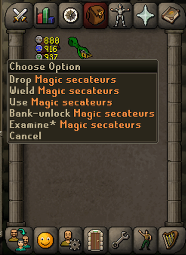

# Bank Locks

Prevent accidentally banking items.

[Demo video](https://youtu.be/ElUo9eI7APs)

Hold shift and right click items to use the new "Bank-lock"/"Bank-unlock" actions. When items are locked,
they cannot be deposited into a bank.

This can be especially useful if you find yourself accidentally banking things you want to keep in your inventory 
(ex. gem bag) or store elsewhere (ex. magic secateurs).

This has been tested to work on:

* Normal bank interface (including deposit all inventory / deposit all equipment)
* Equipment bank interface
* Deposit box (including deposit all inventory / deposit all equipment)

Locked items are saved across sessions, so if you lock an item, quit runelite, and open it again, it will still be 
locked until you right-click "Bank-unlock".

